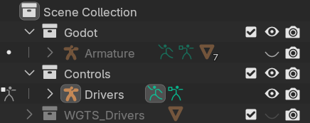
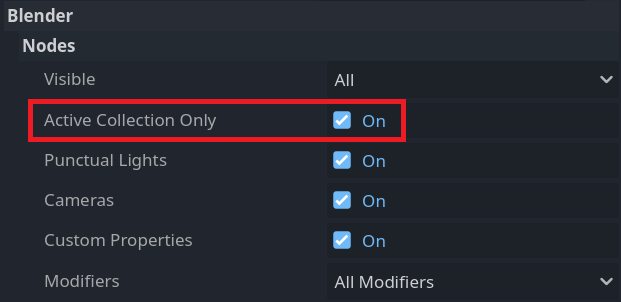
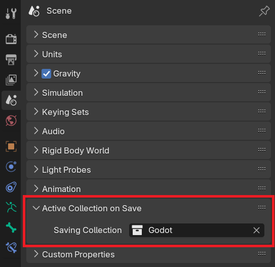

# Blender Addon - Active Collection on Save

This is a really simple addon to automatically change the active collection when saving a file. I made this for working with [Godot Engine](https://godotengine.org/).

## Why do I need this?

Godot is actually pretty good at importing `.blend` file directly. You can tag and skip things just by using a naming suffix. You should check out Godot's [Node type customization using name suffixes](https://docs.godotengine.org/en/4.3/tutorials/assets_pipeline/importing_3d_scenes/node_type_customization.html) doc before deciding on this addon.

However, sometimes you run into other plugins that are hard to change their automatic naming behavior, or you just can't be bothered to change the name every time you create something like animation widgets or extra armatures for constrains. Here's a typical example for a blender setup:

Luckily, Godot has an `Active Collection Only` importer option, which is exactly what I needed, but modifying the model on the fly often changes the active collection. So I made this addon to automatically change the active collection when saving a file.

## Godot Setup

To turn on `Active Collection Only` import option, you need to bring up `Advanced Import Settings` by double clicking your `.blend` file in the `FileSystem` tab in the Godot editor.

Then you can turn on the `Active Collection Only` option.

## Blender Setup

After installing the addon, you can find the relative settings in the `Scene Properties` tab.

Alternatively, you can simply right click a collection and select `Set as Saving Collection` to set it.
